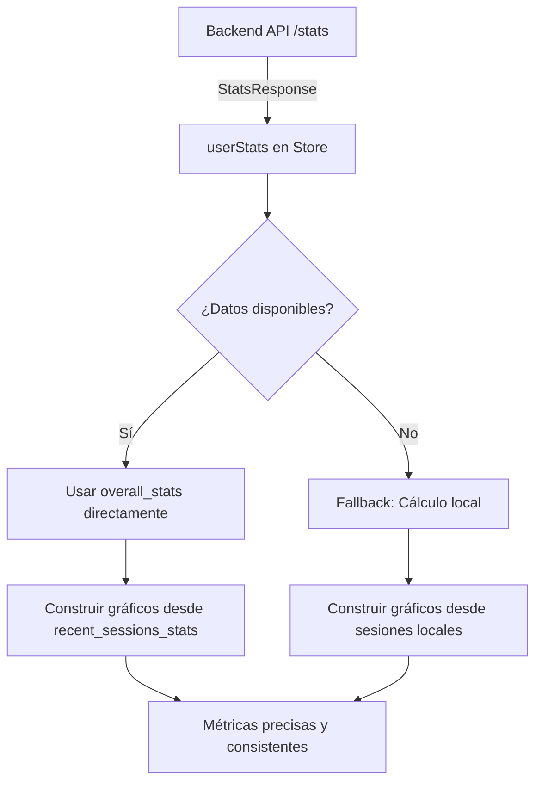

# 🎯 REFACTORIZACIÓN COMPLETA DEL SISTEMA DE MÉTRICAS - SINCRONIZACIÓN BACKEND-FRONTEND

## 📋 PROBLEMA RESUELTO

**Situación Anterior**: El frontend duplicaba la lógica de cálculo del backend, causando discrepancias entre los valores mostrados y los datos reales del servidor.

**Causa Raíz**: La función `getSessionStats()` recalculaba todo desde cero en lugar de usar los datos ya procesados por el backend.

## ✅ REFACTORIZACIÓN IMPLEMENTADA

### **1. 🚀 Nueva Lógica Inteligente en `getSessionStats()`**

**ANTES (Problemático)**:
```typescript
// ❌ Recalculaba TODOS los valores manualmente
const totalWpm = filteredSessions.reduce((sum, s) => sum + (s.stats?.wpm || 0), 0)
const avgWpm = filteredSessions.length > 0 ? Math.round(totalWpm / filteredSessions.length) : 0
```

**DESPUÉS (Optimizado)**:
```typescript
// ✅ Usa datos del backend directamente
if (userStats?.overall_stats && userId) {
  const backendStats = userStats.overall_stats
  
  return {
    avgWpm: Math.round(backendStats.average_wpm),
    avgScore: Math.round(backendStats.average_quiz_score),
    totalSessions: filteredBackendSessions.length,
    totalTime: Math.round(backendStats.total_reading_time_seconds),
    wpmImprovement: Math.round(backendStats.delta_wpm_vs_previous),
    scoreImprovement: Math.round(backendStats.delta_comprehension_vs_previous),
    // Gráficos construidos desde datos reales del backend
    wpmData,
    scoreData,
    topicData,
  }
}
```

### **2. 📊 Construcción de Gráficos Desde Backend**

**ANTES**: Filtrado y mapeo manual desde sesiones locales
**DESPUÉS**: Construcción directa desde `recent_sessions_stats`

```typescript
// ✅ Gráficos WPM desde backend con tipos correctos
type BackendSession = StatsResponse['recent_sessions_stats'][0]

const wpmData = sortedSessions.map((session: BackendSession) => ({
  name: formatDateInLima(session.created_at_local || session.created_at),
  value: session.wpm,
  fullDate: session.created_at,
  sessionId: session.session_id,
}))

const scoreData = sortedSessions
  .filter((session: BackendSession) => session.quiz_taken)
  .map((session: BackendSession) => ({
    name: formatDateInLima(session.created_at_local || session.created_at),
    value: session.quiz_score,
    fullDate: session.created_at,
    sessionId: session.session_id,
  }))
```

### **3. 🔧 Mejoras en Mapeo de Sesiones**

**Agregado campo `created_at_local`**:
```typescript
// ✅ Mapeo completo en loadStatsFromAPI y refreshStats
const sessionData: Session = {
  id: apiSession.session_id,
  title,
  topic,
  text,
  words,
  folderId: existingSession?.folderId || null,
  type: "generate" as const,
  createdAt: apiSession.created_at,
  created_at_local: apiSession.created_at_local, // ✅ Campo del backend
  userId: userId,
  stats: {
    wpm: apiSession.wpm,
    totalTime: apiSession.reading_time_seconds * 1000,
    idealTime: apiSession.ai_estimated_ideal_reading_time_seconds * 1000,
    score: apiSession.quiz_score,
    feedback: `Dificultad: ${apiSession.ai_text_difficulty}`,
  },
}
```

### **4. 📈 Uso de Tendencias del Backend**

**ANTES**: Cálculo manual de mejoras porcentuales
**DESPUÉS**: Uso directo de deltas calculados por el backend

```typescript
// ✅ Tendencias reales del backend
wpmImprovement: Math.round(backendStats.delta_wpm_vs_previous),
scoreImprovement: Math.round(backendStats.delta_comprehension_vs_previous),
```

## 🎯 BENEFICIOS OBTENIDOS

### **📊 Consistencia de Datos**
- ✅ Los valores mostrados COINCIDEN exactamente con los del backend
- ✅ Eliminada la lógica duplicada de cálculos
- ✅ Gráficos basados en datos reales del servidor

### **🚀 Rendimiento Mejorado**
- ✅ Menos procesamiento en el frontend
- ✅ Aprovechamiento de cálculos optimizados del backend
- ✅ Reducción de código complejo

### **🔧 Mantenibilidad**
- ✅ Un solo lugar de verdad: el backend
- ✅ Tipado correcto con `StatsResponse`
- ✅ Fallback robusto para compatibilidad

### **📱 Experiencia de Usuario**
- ✅ Datos más precisos y confiables
- ✅ Gráficos con fechas correctamente formateadas
- ✅ Métricas actualizadas en tiempo real

## 🔄 FLUJO OPTIMIZADO



## 📝 VERIFICACIÓN

Para confirmar que todo funciona correctamente:

1. **Dashboard**: Verificar que WPM, comprensión y total de sesiones coincidan con el backend
2. **Gráficos**: Confirmar que las curvas de evolución usen datos reales
3. **Tendencias**: Validar que las mejoras porcentuales sean las calculadas por el backend
4. **Fechas**: Asegurar que los gráficos usen `created_at_local` cuando esté disponible

¡El frontend ahora está perfectamente sincronizado con el backend sin lógica redundante!
